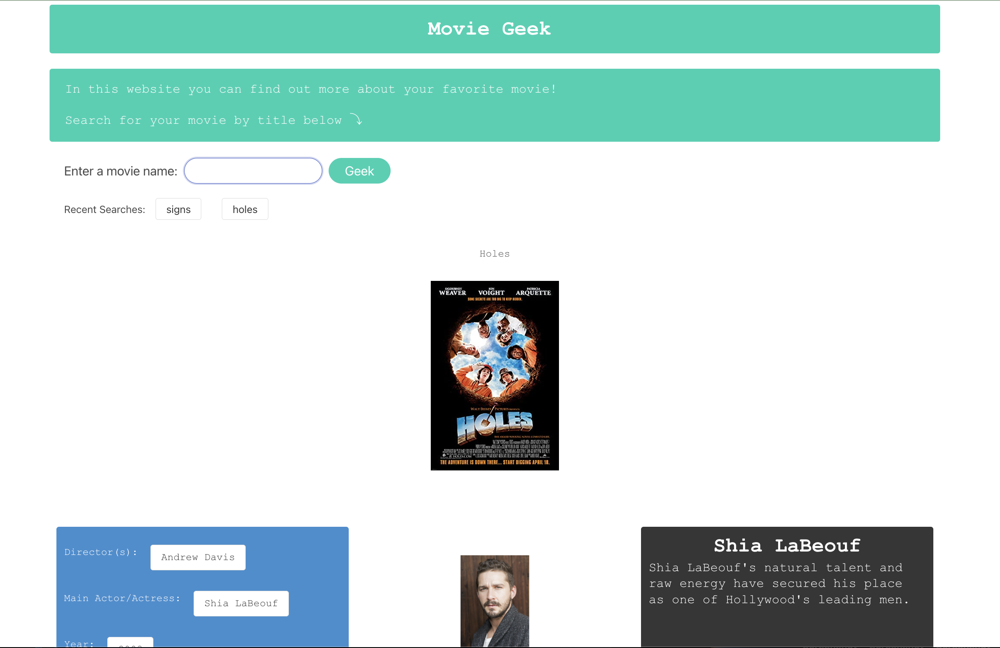
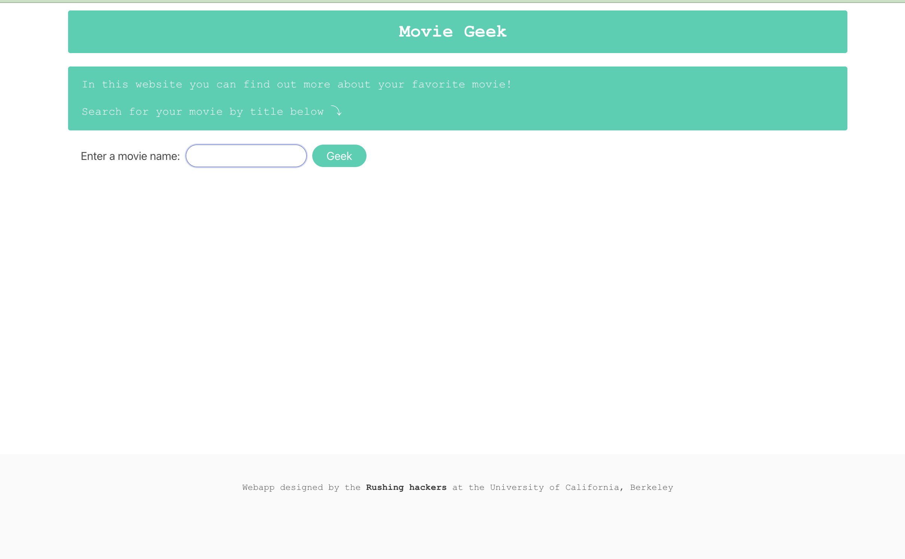

# MovieDetails
Group project to build an app using 2 API calls that incorporates user input and local storage.

Group Members:
- Jorge Gomez
- Maximillian Royal-Eisenberg
- Mariah Wear
- Tri Chau


## Mock-Up

The following image shows the web application's appearance and functionality:

Once a query has been made:


Before a query has been made:



## Deployed Project

https://jogomez.github.io/MovieDetails/

## User Story

```
AS AN online user
I WANT a single platform where I can search a movie and see director, key actor, genre, year, movie poster as well as a bio and image for the main actor/actress
THEN I can see key information about the film clearly presented alongside the main actor/actress. 
```

## Acceptance Criteria 

```
GIVEN a dashboard with form input
WHEN I search for a movie
THEN I am presented with the movie poster, full title, and specific information about the movie that is then added to local storage search history. Information from OMDB and IMDB
WHEN the movie info is pulled up a secondary API call is made to search for a bio of the main Actor from IMDB 
THEN I am presented with the bio and head shot photo alongside the movie details. 
WHEN I click on a recent search I am again presented with the information for that movie.
```


